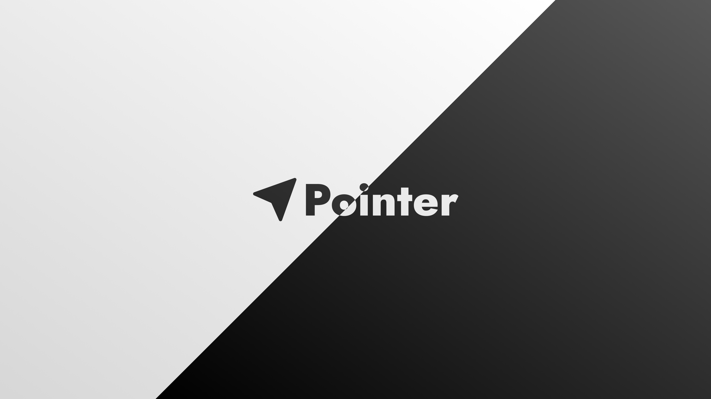

  

  
  
  
  
  

  
  
  
  
  

<h1 align="center">Pointer</h1>

  A standalone desktop code editor with Pointer branding, Pointer app IDs, Pointer data folders, and Pointer release artifacts.

  <a href="#quick-start">Quick Start</a>
  |
  <a href="#features">Features</a>
  |
  <a href="#tech-stack">Tech Stack</a>
  |
  <a href="#pointeride-repositories">PointerIDE Repos</a>
  |
  <a href="#builds">Builds</a>
  |
  <a href="#documentation">Docs</a>

---

## What Is Pointer?

Pointer is an independent editor distribution built from the Pointer-Core codebase. It keeps the familiar layered editor architecture, Monaco editor foundation, extension model, terminal stack, and desktop integration, while shipping as its own product.

Pointer is **not** an official Microsoft product, is **not** Microsoft-signed, and does **not** use the official Microsoft Marketplace. Product identity lives in [product.json](product.json), including the app name, data folders, URL protocol, Windows IDs, server name, tunnel name, themes, and built-in extensions.

## Quick Start

| Goal | Command | What it does |
|---|---|---|
| Start existing dev output | `run\start.bat` | Launches the app only. No watcher, install, rebuild, or compile. |
| Start live dev mode | `run\start-dev.bat` | Ensures dependencies, starts the watcher, and launches Pointer. |
| Stop dev processes | `run\dev-stop.bat` | Stops Pointer dev watchers and app processes for this repo. |
| Build portable release | `run\build-pointer.bat` | Creates a packaged app under `.build\artifacts\`. |
| Build ZIP + installer | `run\build-pointer.bat --Zip --Installer` | Creates portable, ZIP, and Inno Setup installer artifacts. |

## Features

| Area | Included |
|---|---|
| Editor core | Monaco-based editing, syntax highlighting, navigation, search, command system |
| Desktop app | Electron shell, native menus, app icon, Windows packaging, Pointer URI protocol |
| Terminal | Integrated terminal powered by xterm.js and native pty integration |
| Extensions | Built-in language, Git, Markdown, theme, notebook, media, and developer tooling extensions |
| Agent workflows | Agent sessions and chat/session infrastructure under `src/vs/sessions/` and workbench chat areas |
| Themes | Pointer onboarding themes configured in `product.json` and theme defaults |
| Release pipeline | Local Node runtime, native rebuilds, Electron download, Gulp packaging, ASAR, rcedit, Inno Setup |

## Product Identity

| Field | Value |
|---|---|
| Display name | `Pointer` |
| Application name | `pointer` |
| User data folder | `.pointer` |
| Shared data folder | `.pointer-shared` |
| URL protocol | `pointer://` |
| Windows AppUserModelId | `Pointer.Pointer` |
| Server app | `pointer-server` |
| Tunnel app | `pointer-tunnel` |

## Tech Stack

| Layer | Stack |
|---|---|
| Language | TypeScript, JavaScript, Rust CLI pieces, PowerShell/Bat scripts |
| Runtime | Node.js `22.22.1`, Electron `39.8.8` |
| UI/editor | Pointer workbench, Monaco editor, xterm.js, Codicons |
| Build system | npm, Gulp 4, esbuild transpile path, ASAR packaging |
| Native build | node-gyp, MSVC, Visual Studio 2022 C++ Desktop Workload |
| Installer | Inno Setup, Windows resources, rcedit |
| Testing | Mocha, Playwright, smoke tests, integration tests, layer checks |

## Repository Map

| Path | Purpose |
|---|---|
| `src/vs/base/` | Foundation utilities and cross-platform primitives |
| `src/vs/platform/` | Services, dependency injection, storage, files, telemetry, platform APIs |
| `src/vs/editor/` | Monaco editor core |
| `src/vs/workbench/` | Main app shell, views, commands, services, extension API |
| `src/vs/code/` | Electron desktop startup and main process |
| `src/vs/server/` | Server and remote entry points |
| `src/vs/sessions/` | Agent sessions window and agentic workflows |
| `extensions/` | Built-in extensions and themes |
| `build/` | Gulp tasks, package logic, Electron download, CI helpers |
| `scripts/` | Lower-level PowerShell, Bat, Node, and shell helpers |
| `run/` | Human-friendly Windows entrypoints |
| `docs/` | Pointer project, stack, and release documentation |

## PointerIDE Repositories

| Repository | Description |
|---|---|
| [Pointer](https://github.com/PointerIDE/Pointer) | Main IDE |
| [PointerAssets](https://github.com/PointerIDE/PointerAssets) | Brand and media assets |
| [PointerDeprecated](https://github.com/PointerIDE/PointerDeprecated) | Legacy desktop app and CLI |
| [PointerDiscordBot](https://github.com/PointerIDE/PointerDiscordBot) | Discord bots |
| [PointerWebsite](https://github.com/PointerIDE/PointerWebsite) | Marketing and documentation site |

## Builds

Release output is written to `.build\artifacts\`.

| Artifact | Description |
|---|---|
| `.build\artifacts\Pointer-win32-x64\` | Portable app folder |
| `.build\artifacts\Pointer-win32-x64.zip` | Optional portable ZIP |
| `.build\artifacts\PointerSetup-x64-<version>.exe` | Optional Windows installer |

Build logs are stored under `.codex-tools\logs\`. The latest run is referenced by `.codex-tools\logs\latest-run.txt`.

## Documentation

- [docs/PROJECT_GUIDE.md](docs/PROJECT_GUIDE.md) - complete human and coding-AI project guide
- [docs/TECH_STACK.md](docs/TECH_STACK.md) - short technical stack and ownership map
- [docs/RELEASE.md](docs/RELEASE.md) - release build, artifacts, logs, and troubleshooting
- [AGENTS.md](AGENTS.md) - root instructions for coding agents
- [.github/copilot-instructions.md](.github/copilot-instructions.md) - Copilot-style coding agent rules
- [CONTRIBUTING.md](CONTRIBUTING.md) - contribution workflow and review checklist

## Validation Cheatsheet

| Change area | First check |
|---|---|
| `src/` TypeScript | `npm run compile-check-ts-native` |
| `extensions/` TypeScript | `npm run gulp compile-extensions` |
| `build/` TypeScript | `cd build && npm run typecheck` |
| Architecture/layers | `npm run valid-layers-check` |
| Unit tests | `scripts\test.bat --grep <pattern>` |

## Contributing

Contributions should keep the Pointer product identity intact, follow the existing layered architecture, keep changes scoped, and validate TypeScript changes before test runs.

Start with [CONTRIBUTING.md](CONTRIBUTING.md) and [docs/PROJECT_GUIDE.md](docs/PROJECT_GUIDE.md).

## License

Pointer retains the original [MIT license](LICENSE.txt) for upstream-derived code and ships as an independently branded product.
